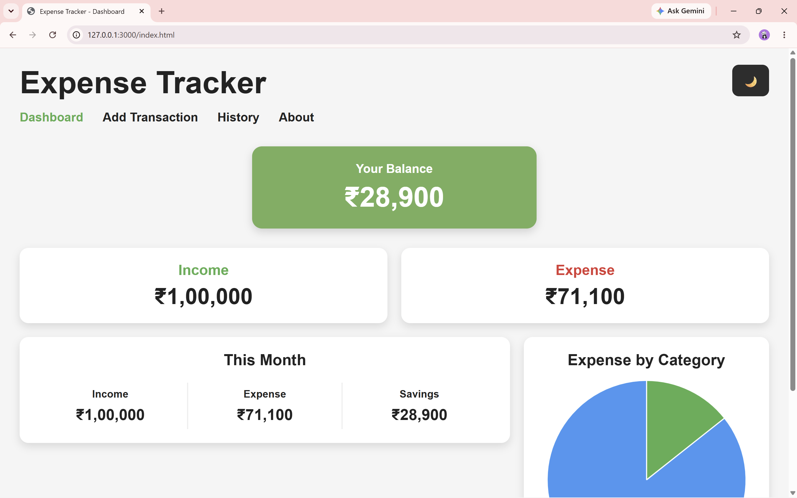

# 💰 Expense Tracker Web Application

A modern and responsive **Expense Tracker Web Application** built using **HTML, CSS, JavaScript, and Chart.js**. The application enables users to efficiently manage their income and expenses through an interactive dashboard, transaction management system, and insightful visualizations.

---

## 📌 Overview

This project helps users:

- Track income and expenses
- Monitor account balance
- Analyze monthly savings
- Visualize expenses using charts
- Search, filter, and sort transactions
- Download transaction history as CSV
- Switch between Light and Dark Mode

---

# 📸 Project Screenshots

## 🏠 Dashboard



---

## ➕ Add Transaction


---

## 📜 Transaction History


---

## ℹ️ About Page


---

# ✨ Features

- 💰 Real-time Balance Calculation
- 📈 Income & Expense Summary
- 📅 Monthly Income, Expense & Savings
- ➕ Add New Transactions
- 📜 Transaction History
- 🔍 Search Transactions
- 🗂 Filter by Category
- 🔄 Filter by Transaction Type
- ↕ Sort Transactions
- 🥧 Expense Category Pie Chart
- 🌙 Dark / Light Theme
- 📥 Export Transactions as CSV
- 📱 Responsive User Interface

---

# 🛠️ Technologies Used

| Technology | Purpose |
|------------|---------|
| HTML5 | Structure |
| CSS3 | Styling |
| JavaScript (ES6) | Functionality |
| Chart.js | Data Visualization |
| Local Storage | Data Persistence |

---

# 📂 Project Structure

```text
expense-tracker-web-app/
│
├── index.html
├── add.html
├── history.html
├── about.html
│
├── style.css
├── script.js
│
├── screenshots/
│   ├── dashboard.png
│   ├── add.png
│   ├── history.png
│   └── about.png
│
└── README.md
```

---

# 🚀 Getting Started

### Clone the Repository

```bash
git clone https://github.com/Preetiraj01/expense-tracker-web-app.git
```

### Open the Project

```bash
cd expense-tracker-web-app
```

Open **index.html** in your preferred web browser.

---

# 📊 Dashboard

The dashboard provides an overview of:

- Current Balance
- Total Income
- Total Expenses
- Monthly Statistics
- Expense Distribution Chart

---

# 📜 Transaction Management

Users can:

- Add Income
- Add Expenses
- Delete Transactions
- Search Transactions
- Filter by Category
- Filter by Type
- Sort Transactions
- Download CSV Report

---

# 💡 Future Enhancements

- 🔐 User Authentication
- ☁️ Database Integration
- 📄 PDF Report Export
- 🎯 Budget Goal Tracker
- 🔔 Budget Notifications
- 📈 Monthly Expense Trend Graph
- 💳 Multiple Account Support

---

# 👩‍💻 Developer

**Preeti Raj**

B.Tech – Computer Science & Engineering

Sir M. Visvesvaraya Institute of Technology

GitHub: **https://github.com/Preetiraj01**

---

# ⭐ Support

If you found this project useful, please consider giving it a **⭐ Star** on GitHub.

It motivates me to build more projects!

---

# 📄 License

This project is created for **educational and learning purposes**.
